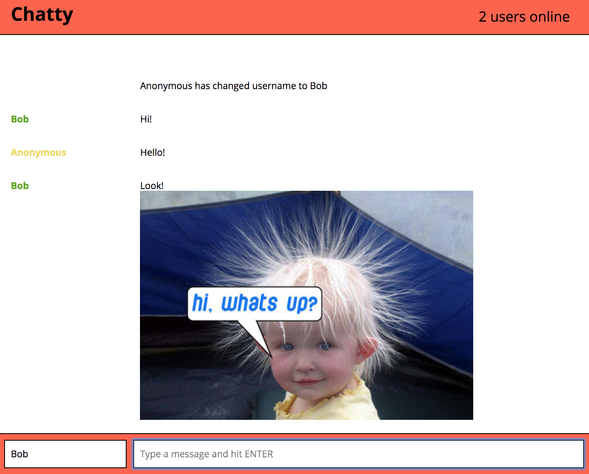

chattyApp
=====================

A web app that allows multiple users to chat online and send images.
Each user has a username color randomly picked for them at connection.

## Screenshots

### Dependencies

* Babel-core
* Babel-preset-es2015
* Babel-preset-react
* Css-loader
* Node-sass
* Randomcolor
* React
* React-Dom
* Sass-loader
* Sockjs-client
* Style-loader
* uuid
* Webpack
* Webpack-dev-server
